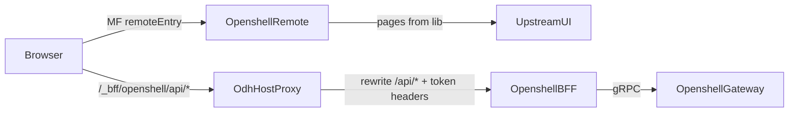

# OpenShell → ODH Federation Strategy

Architecture decisions for embedding [openshell-dashboard](https://github.com/Gkrumbach07/openshell-dashboard) (standalone UI + BFF) into odh-dashboard as a Module Federation remote.

Spike evidence: [SPIKE.md](./SPIKE.md), [agent-ops POC](../agent-ops/SPIKE-POC.md).

> **Status:** Decision-locked for the `packages/openshell` scaffold. Not a production module.

---

## Mental Model

ODH never imports the whole OpenShell SPA. The host loads a **remoteEntry.js** that registers **extensions** (nav + routes). Route components are thin wrappers that mount upstream **pages**. Browser API calls go through the **odh-dashboard host proxy**, which forwards auth headers to the OpenShell **BFF**, which talks to the OpenShell **gateway** (gRPC).



Upstream dual goals (ranked):

1. **Primary** — standalone OpenShell product (SPA + BFF + gateway).
2. **Secondary** — stable **embed SDK** (npm library + BFF env/auth contract), not an ODH-specific fork.

---

## Decision Dimensions

Four decisions are independent. Mixing them incorrectly is the usual failure mode.

| Dimension | Question |
|-----------|----------|
| **A. UI source** | How does OpenShell UI code enter the ODH monorepo / build? |
| **B. MF ownership** | Who builds `remoteEntry.js` — upstream or an ODH adapter? |
| **C. BFF packaging** | How is the Go BFF built, versioned, and deployed? |
| **D. Runtime boundary** | Auth, API prefix, WS, shared deps — host-owned vs module-owned? |

---

## Locked Decisions

| Decision | Lock | Rationale |
|----------|------|-----------|
| UI source | **A1** npm lib (**A2** git/file interim) | Versioned embed SDK; upstream stays free of `@odh-dashboard/*` |
| MF ownership | **B1** ODH `packages/openshell` adapter | Spike-proven; upstream stays library + standalone SPA |
| BFF | **C1** upstream binary/image as module Deployment | Avoid reimplementing gateway client; auth headers already match |
| Proxy | `/_bff/openshell/api` → `/api` | Same shape as mlflow `/_bff/…` |
| Shared deps | React + PatternFly singletons only | Router v6≠v7 and Query v5≠v4 until peers align |
| Auth | Proxy-delegated; auth-bridge spike before GA | Upstream post-#12; never mount `LoginPage` in federated mode |
| Terminal | Feature-gated until WS honors `apiBasePath` | Known upstream gap |

**Rejected for product:** iframe / reverse-proxy of the standalone SPA (**B3**). **Deferred:** upstream-built MF remote (**B2** / **A4**) until a second federated host needs the same `remoteEntry`. **Contingency only:** subtree vendor (**A3** / **C2**) or ODH adapter BFF (**C3**) after auth-bridge proves upstream cannot accept OpenShift tokens.

---

## A. UI Source Strategies

### A1. Published npm + thin ODH adapter (chosen)

Upstream publishes the existing `build:lib` exports (`./pages`, `./components`, `./api`, `./types`, `./slots`). ODH owns `packages/openshell/` with MF config, extensions, and wrappers.

### A2. Git / file interim (bridge)

Same consume path until npm publish lands. Spike used sibling `build:lib` + webpack aliases.

### A3. Git subtree under `packages/openshell/upstream/`

Use only if publish fails or ODH must ship critical patches faster than upstream. Sync tax and fork drift risk.

### A4. Upstream is the MF remote

Upstream emits `remoteEntry.js`; ODH only registers the URL. Attractive for multi-host MF; forces upstream into host contracts. Later evolution, not default.

---

## B. Module Federation Ownership

### B1. ODH adapter owns MF (chosen)

Upstream = embeddable React library. ODH `packages/openshell/frontend`:

- Exposes `./extensions` (optional `./extension-points`)
- Shares React, react-dom, PatternFly as singletons
- Does **not** share `react-router-dom` or `@tanstack/react-query` until versions align
- Wrapper supplies `QueryClientProvider` (v5 local), `AlertProvider`, `setApiBasePath('/_bff/openshell')`, `setSessionExpiredHandler`, nav callbacks, `SlotProvider` when needed
- Prefer controlled props / callbacks over in-page routing

### B2. Upstream dual webpack (`standalone` + `federated`)

Revisit only if a second MF host needs an identical remoteEntry. Upstream must document shared deps and a host-agnostic embed API (no ODH imports).

### B3. iframe SPA

Reject for product. Demo-only.

---

## C. BFF Packaging

### C1. Ship upstream BFF as module Deployment (chosen)

Deploy upstream Go server as `odh-dashboard-openshell-ui` (standalone module pod) or sidecar. Host Fastify proxies `/_bff/openshell/api` → `/api` with `authorize: true`.

Image options: upstream multi-stage Dockerfile, or ODH workspace Dockerfile that builds a pinned upstream Go module / git tag.

| Concern | Contract |
|---------|----------|
| Env | `OPENSHELL_GATEWAY_URL`, `GATEWAY_CA_CERT`, `AUTH_DISABLED=false`, `AUTH_TOKEN_HEADER=x-forwarded-access-token`, feature flags |
| Probes | liveness `/api/v1/healthz`, readiness `/api/v1/readyz` |
| Version pin | UI npm version and BFF image tag from the **same** upstream release / SHA |

### C2. Vendor BFF via subtree

Fallback if ODH-only patches (token exchange, probes) cannot land upstream quickly.

### C3. Thin ODH adapter BFF

Last resort after auth-bridge proves upstream BFF cannot accept OpenShift tokens even with config.

### C4. Co-located process

One module Service can expose API + static/`remoteEntry` (upstream already serves static in standalone). Host still fronts `/_mf/openshell/` and `/_bff/openshell/api`. Orthogonal to C1–C3.

---

## D. Runtime Boundary

### Auth (proxy-delegated)

1. Always put OpenShell BFF behind host proxy with `authorize: true`.
2. Rely on `x-forwarded-access-token` (configure `AUTH_USER_HEADER` if display fallback is needed).
3. Never mount upstream `LoginPage` in federated mode.
4. Auth-bridge spike: confirm gateway accepts the oauth-proxy access token; if issuers differ → gateway trust config, BFF token exchange, or (worst) C3.

### API base path and WebSockets

- HTTP: host rewrite + `setApiBasePath('/_bff/openshell')`.
- WS/terminal: upstream must build URLs from `apiBasePath` (or relative URLs). Gate terminal until fixed; host proxy must support WS upgrade when terminal ships.

### Shared dependencies

| Dep | Strategy |
|-----|----------|
| `react` / `react-dom` / PatternFly | MF singleton (host wins) |
| `react-router-dom` | Do not share until peers allow v6\|v7; callbacks + local `MemoryRouter` only if needed |
| `@tanstack/react-query` | Module-local v5 `QueryClientProvider`; do not share with host v4 |

### Slots

Use upstream `./slots` for cross-cutting UI. ODH wrappers implement slot components that call ODH services. Standalone keeps empty/default slots.

---

## Target Shape

```text
openshell-dashboard (upstream)
  frontend/   → standalone webpack SPA
              → build:lib → npm package (pages, api, slots, providers)
  backend/    → Go BFF image (proxy auth, probes, gateway client)

odh-dashboard
  packages/openshell/
    frontend/ → MF remote (extensions, wrappers, shared React/PF only)
    (no forked BFF source by default)
  manifests/modules/openshell/ → Deployment of upstream BFF(+assets) image
  host proxy → /_mf/openshell/* and /_bff/openshell/api → module Service
```

Recommended MF identity (also in this package’s `package.json` → `recommendedModuleFederation`): remote `openshell`, FE port `9113`, service port `8943`.

---

## Upstream Influence List

Prioritized so dual-mode stays cheap:

1. Publish npm with exports and peerDependency ranges for embed hosts.
2. **Remove co-located package CSS from the lib surface** — done in [openshell-dashboard#25](https://github.com/Gkrumbach07/openshell-dashboard/pull/25); ODH sync/webpack workarounds removed.
3. Host integration doc (replace stale OIDC README): proxy auth, `setApiBasePath`, required providers, callback props, “do not use LoginPage when embedded.”
4. All network URLs (HTTP + WS) honor `apiBasePath`.
5. Router-agnostic pages (callbacks / controlled tabs) for v6/v7 hosts.
6. Keep zero `@odh-dashboard/*` imports in upstream — ODH adapts at the wrapper boundary.
7. Optional later: federated webpack mode (B2) only if a second MF host needs identical `remoteEntry`.

---

## CSS packaging

Upstream [PR #25](https://github.com/Gkrumbach07/openshell-dashboard/pull/25) deleted co-located CSS (`SandboxCard.css`, `SandboxEgressSummary.css`) in favor of PF props/utilities per [ADR 0001](https://github.com/Gkrumbach07/openshell-dashboard/blob/main/docs/adrs/0001-downstream-consumption.md). Copy-into-dist was rejected ([#28](https://github.com/Gkrumbach07/openshell-dashboard/pull/28) closed).

| Phase | Status |
|-------|--------|
| Upstream delete co-located CSS | **Done** (main @ 8bf7a76+) |
| ODH `poc:sync-css` + `openshellCssFromSrcPlugin` | **Removed** |
| Third-party CSS (`@xterm/xterm/css/xterm.css`) | Consumer bundler when terminal enabled |

---

## Anti-Patterns

- Reimplementing the BFF in ODH only because other packages have a `bff/` folder.
- Sharing Query/router singletons across major version gaps.
- iframe of the standalone app as the product path.
- Vendoring + heavy local patches without a sync/exit plan.
- Mounting standalone auth UI inside the ODH chrome.
- Shipping or syncing co-located CSS into MF remotes (use PF props/utilities upstream instead).

---

## Next Scaffold Story

**Done (spike POC):** [`packages/openshell`](../openshell/) implements A1/A2 + B1 + C1 locally (`file:` lib, MF adapter, upstream BFF on :8943, `/_bff/openshell/api`). Agent-ops gut superseded.

**Still for production story:** npm publish (#11), auth-bridge (oauth-proxy token → gateway), cluster manifests, Cypress, terminal WS `apiBasePath` (+ xterm CSS if terminal stays).
